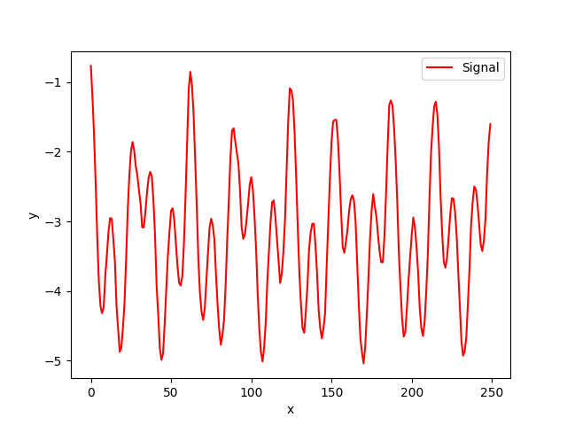
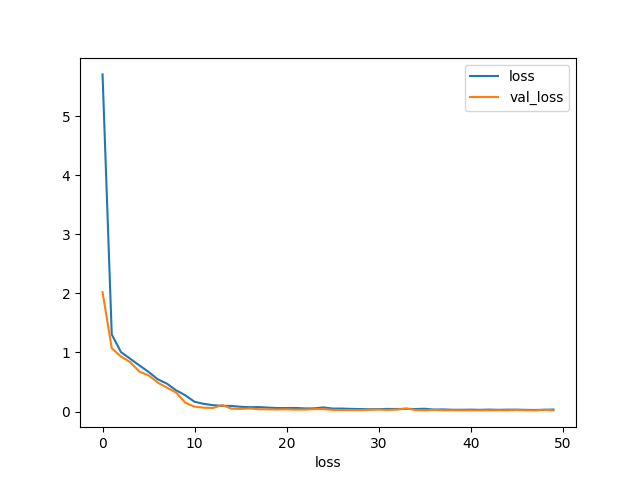
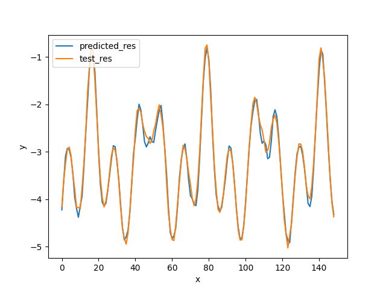

# Практическое задание 7
Ларин Антон  
Гр. 8383
  
## Условие задачи

> Вариант 4  

Необходимо построить рекуррентную нейронную сеть, которая будет прогнозировать значение некоторого периодического сигнала.  
К каждому варианту предоставляется код, который генерирует последовательность. Для выполнения задания необходимо:  
1. Преобразовать последовательность в датасет, который можно подавать на вход нейронной сети (можно использовать функцию gen_data_from_sequence из примера)
2. Разбить датасет на обучающую, контрольную и тестовую выборку
3. Построить и обучить модель
4. Построить график последовательности, предсказанной на тестовой выборке (пример построения также есть в примере). Данный график необходимо также добавить в pr
  
Также, в файлах с кодом вариантов есть функция draw_sequence, которая позволяет нарисовать часть последовательности  

#### Вариант 4

## Выполнение работы

Исходная функция выглядит следующим образом:
```python
def func(i):
    i = i % 31
    return ((i-15) ** 2)/100 - 4
```
  
Она преобразовывается в датасет
```python
def gen_sequence(seq_len = 1000):
    seq = [math.cos(i/2) + func(i) + random.normalvariate(0, 0.04) for i in range(seq_len)]
    return np.array(seq)

def gen_data_from_sequence(seq_len = 1000, lookback = 10):
    seq = gen_sequence(seq_len)
    past = np.array([[[seq[j]] for j in range(i,i+lookback)] for i in range(len(seq) - lookback)])
    future = np.array([[seq[i]] for i in range(lookback,len(seq))])
    return (past, future, seq)
```
  
Далее датасет разбивается на бучающую, контрольную и тестовую выборки  
```python
dataset_size = len(data)
train_size = (dataset_size // 10) * 7
val_size = (dataset_size - train_size) // 2

train_data, train_res = data[:train_size], res[:train_size]
val_data, val_res = data[train_size:train_size+val_size], res[train_size:train_size+val_size]
test_data, test_res = data[train_size+val_size:], res[train_size+val_size:]
```

Модель приняла следующий вид:
```python
model = Sequential()
model.add(layers.GRU(40,recurrent_activation='sigmoid',input_shape=(None,1),return_sequences=True))
model.add(layers.LSTM(40,activation='relu',input_shape=(None,1),return_sequences=True,dropout=0.2))
model.add(layers.GRU(32,input_shape=(None,1),recurrent_dropout=0.2))
model.add(layers.Dense(1))
```

Далее модель скомпилирована и обучена на датасете  
```python
model.compile(optimizer='adam', loss='mse')
history = model.fit(train_data,train_res,epochs=50,validation_data=(val_data, val_res))
```
---  

Модель обучена на 50 эпохах 

## Полученные результаты
Вид исходной функции на графике:


Функция потерь при обучении и валидации:  


Полученная последовательность и её сравнение с исходной функцией  
